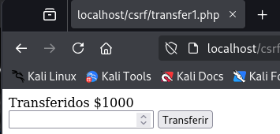

# PPS-Unidad3Actividad6-CSRF

## Código vulnerable

Creación del archivo `transfer1.php` con código vulnerable:

```
<?php
if ($_SERVER["REQUEST_METHOD"] == "POST") {
$amount = $_POST["amount"];
echo "Transferidos $$amount";
}
?>
<form method="post">
<input type="number" name="amount">
<button type="submit">Transferir</button>
</form>
```


### Explotación de CSRF

El atacante crea un archivo malicioso `csrf_attack.html`:
```
<!DOCTYPE html>
<html>
<body>
	
</body>
</html>
```


Revisamos el log de apache para confirmar el ataque en `/var/log/apache2/access.log`.

```
docker exec lamp-php83 /bin/bash -c "tail -5 /var/log/apache2/other_vhosts_access.log"
```


Creamos el archivo `csrf_attack2.html`:
```
<!DOCTYPE<html>
<body>
        <form action="http://localhost/csrf/transfer1.php" method="POST">
                <input type="hidden" name="amount" value="1000">
                <input type="submit">
        </form>
        <script>
                document.forms[0].submit();
        </script>
</body>
</html>
```




## Mitigaciones

### Verificando que transfer.php está protegiendo correctamente con el token CSRF

Modificamos el fichero `transfer1.php`:

```
<?php
session_start();
// Generar un token CSRF si no existe
if (empty($_SESSION['csrf_token'])) {
        $_SESSION['csrf_token'] = bin2hex(random_bytes(32));
}
// Solo permitir solicitudes POST con un token CSRF válido
if ($_SERVER["REQUEST_METHOD"] == "POST") {
        if (!isset($_POST['csrf_token']) || $_POST['csrf_token'] !== $_SESSION['csrf_token']) {die("CSRF detectado. Acción bloqueada.");
        }
        $amount = $_POST["amount"];
        echo "Transferidos $$amount";
}
?>
<form method="post">
        <input type="number" name="amount">
        <input type="hidden" name="csrf_token" value="<?php echo $_SESSION['csrf_token']; ?>">
        <button type="submit">Transferir</button>
</form>
```


### Bloqueando Solicitudes CSRF con Encabezados HTTP

Modificamos el fichero `transfer1.php`:

```
// Generar un token CSRF si no existe
if (empty($_SESSION['csrf_token'])) {
        $_SESSION['csrf_token'] = bin2hex(random_bytes(32));
}
// Solo permitir solicitudes POST con un token CSRF válido
if ($_SERVER["REQUEST_METHOD"] == "POST") {
        if (!isset($_POST['csrf_token']) || $_POST['csrf_token'] !== $_SESSION['csrf_token']) {
                die("CSRF detectado. Acción bloqueada.");
        }
// Bloquear peticiones que no sean AJAX legítimas
        if (!isset($_SERVER['HTTP_X_REQUESTED_WITH']) || $_SERVER['HTTP_X_REQUESTED_WITH'] !=='XMLHttpRequest') {
                die("CSRF detectado. Acción no permitida.");
        }

        $amount = $_POST["amount"];
        echo "Transferidos $$amount";
}
?>
<form method="post">
        <input type="number" name="amount">
        <input type="hidden" name="csrf_token" value="<?php echo $_SESSION['csrf_token']; ?>">
        <button type="submit">Transferir</button>
</form>
```


### Proteger con SameSite=Strict en Cookies

Agregare el siguiente código al fichero `transfer1.php`:

```
session_set_cookie_params(['samesite' => 'Strict']);

session_start();
```


### Probar con todas la mitigaciones

Aplicamos el siguiente código al fichero `transfer1.php`:

```
<?php
// Configurar la cookie de sesión para bloquear ataques CSRF
session_set_cookie_params([
        'samesite' => 'Strict', // Bloquea solicitudes desde otros sitios
        'httponly' => true, // Bloquea acceso a la cookie desde JavaScript
        'secure' => false // Cambiar a true si usas HTTPS
]);
session_start();
// Generar un token CSRF si no existe
if (empty($_SESSION['csrf_token'])) {
        $_SESSION['csrf_token'] = bin2hex(random_bytes(32));
}
// Solo permitir solicitudes POST
if ($_SERVER["REQUEST_METHOD"] !== "POST") {
        die("Error: Método no permitido");
}
// 1️ - Validar que el token CSRF está presente y es correcto
if (!isset($_POST['csrf_token']) || $_POST['csrf_token'] !== $_SESSION['csrf_token']){
        die("CSRF detectado. Acción bloqueada.");
}
// 2️ - Validar que la solicitud proviene del mismo origen
if (!isset($_SERVER['HTTP_REFERER']) || parse_url($_SERVER['HTTP_REFERER'],PHP_URL_HOST) !== $_SERVER['HTTP_HOST']) {
        die("CSRF detectado: Referer inválido.");
}
// 3️ - Bloquear peticiones que no sean AJAX
if (!isset($_SERVER['HTTP_X_REQUESTED_WITH']) || $_SERVER['HTTP_X_REQUESTED_WITH'] !=='XMLHttpRequest') {
        die("CSRF detectado: No es una solicitud AJAX válida.");
}
// Si todas las validaciones pasan, procesar la transferencia
$amount = $_POST["amount"];
echo "Transferidos $$amount";
?>
<form method="post">
        <input type="number" name="amount">
        <input type="hidden" name="csrf_token" value="<?php echo $_SESSION['csrf_token'];
?>">
<button type="submit">Transferir</button>
</form>
```


